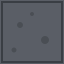
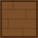
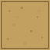
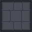
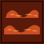
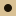

# Texturas del Pathfinder Battle Map

Catálogo de texturas disponibles para usar en las subdivisions.
**Cualquier textura listada acá puede ser usada en cualquier subdivision** (el GM las elige desde la app).

## Cómo agregar una textura nueva

1. **Commiteá el archivo** en la carpeta de la categoría correspondiente:
   ```
   public/pieces/textures/<categoria>/<nombre>.svg
   ```
   Formatos aceptados: `.svg`, `.png`, `.webp`, `.jpg`.

2. **Agregá una entrada** en `packages/assets/src/catalog.ts` con el id y la `imagePath` correspondiente. Convención de ids: `<categoria>-<basename>` (ej. `floor-stone`, `wall-stone`).

3. **Listo**. La galería en `/admin/textures` y el `TexturePalette` en el editor lo reflejarán automáticamente.

> 💡 **Tip**: para regenerar el catálogo a partir de los archivos, corré `pnpm --filter assets generate-catalog` y copiá el output a `catalog.ts` (o reemplazalo).

---

## Floor (pisos)

| ID | Preview | Tags | Notas |
|---|---|---|---|
| `floor-stone` |  | stone, dungeon, interior | Piedra gris, suelo de dungeon genérico |
| `floor-wood` |  | wood, interior, warm | Madera, ideal para posadas o casas |
| `floor-sand` |  | sand, desert, exterior | Arena, ideal para exteriores/desiertos |

## Wall (muros)

| ID | Preview | Tags | Notas |
|---|---|---|---|
| `wall-stone` |  | stone, dungeon | Muro de piedra, ideal para dungeons |

## Water (agua)

| ID | Preview | Tags | Notas |
|---|---|---|---|
| `water-plain` |  | water, liquid | Agua con ondas suaves |

## Lava

| ID | Preview | Tags | Notas |
|---|---|---|---|
| `lava-plain` |  | lava, liquid, fire, danger | Lava con grietas naranjas brillantes |

## Decoration (decoraciones)

| ID | Preview | Tags | Notas |
|---|---|---|---|
| `decoration-marker` |  | marker, subdivision | Marcador genérico para objetos pequeños (16×16) |

---

## Convenciones

- **Tamaño recomendado**: 64×64px para tiles "grandes" (floor, wall, water, lava), 16×16px o menor para decoraciones.
- **Cuadrícula**: si el tile es repetible (seamless), asegurate de que los bordes calcen. Si no, agregale un borde o marca.
- **Color de fondo**: para tiles "vacíos" (transparentes), usá SVG con `fill="none"` o PNG con alpha.
- **Categorías**: el directorio determina la categoría. Si ponés un SVG en una carpeta que no es una categoría válida, se le asigna `other`.

## Cómo crear tus propios SVG

Herramientas recomendadas:
- **Inkscape** (gratis, escritorio) — vector editor completo
- **SVGator** (web, freemium) — más simple
- **Figma** (web, freemium) — para diseñar y exportar como SVG
- **Cualquier editor de texto** — los SVG son texto plano

Para un tile simple de 64×64:

```xml
<svg xmlns="http://www.w3.org/2000/svg" viewBox="0 0 64 64" width="64" height="64">
  <rect width="64" height="64" fill="#5a5e66"/>
  <rect x="2" y="2" width="60" height="60" fill="none" stroke="#3a3e44" stroke-width="2"/>
  <!-- detalles decorativos acá -->
</svg>
```

Para un tile seamless (repetible), los bordes deben coincidir — copiá los píxeles del borde opuesto al lado adyacente.
